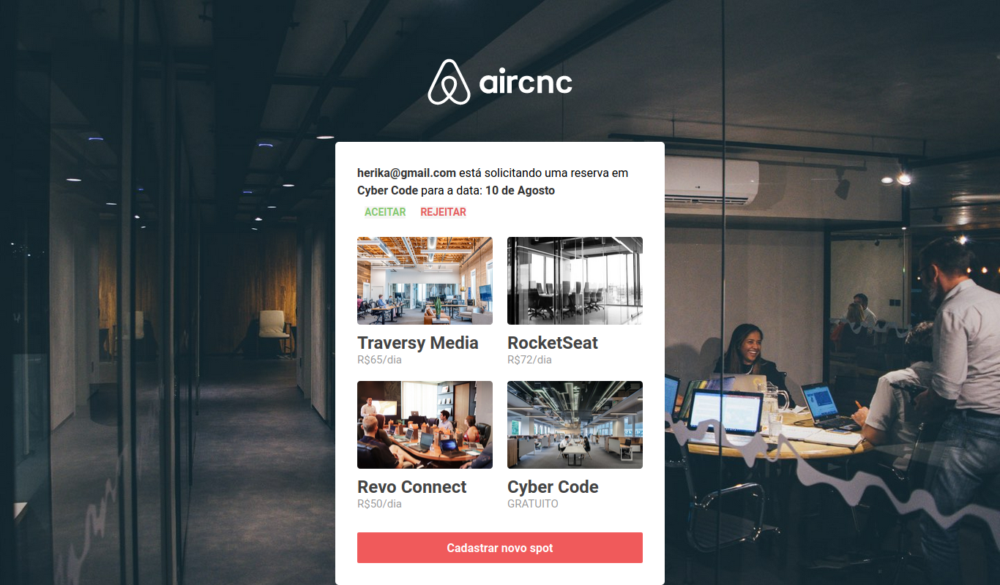

# omnistack-week-9-aircnc

## Project

***EN:*** Inspired by Airbnb, this application called Aircnc (Air Coffee & Code) was developed during the event "omnistack semana" provided by RocketSeat. This project was created thinking about the connection between companies and developers and aims to facilitate the possibility for the developer to schedule a day to get to know a company and its technologies, considering that the available companies will give this space to share their experience, routines and how the place works.

***PT-BR:*** Inspirada no Airbnb foi desenvolvida esta aplicação chamada Aircnc (Air Coffee & Code), durante o evento "semana omnistack" disponibilizado pela RocketSeat. Este projeto foi criado pensando na conexão entre empresas e desenvolvedores e tem como objetivo de facilitar a possibilidade do desenvolvedor agendar um dia para conhecer uma empresa e suas tecnologias, considerando que as empresas disponíveis darão esse espaço para compartilhar sua experiência, rotinas e como o local de trabalho funciona.
## Technologies

This project was developed with the following technologies:

- HTML
- CSS
- ReactJS
- React Native
- Expo
- NodeJS
- Express
- MongoDB
***

## Preview Web

***

## Preview Mobile

***

### How To Install

To clone and run this application, you'll need Git, Node.js & Yarn installed on your computer.

From your command line:

#### Install AirCnC API 

```bash
# Clone this repository
$ git clone https://github.com/gideonfernandes/omnistack-week-9-aircnc.git

# Go into the repository
$ cd omnistack-week-9-aircnc/backend

# Install dependencies
$ yarn install

# Start server
$ yarn dev

# running on port 8888
```

#### Install AirCnC Web

```bash
# Go into the repository
$ cd omnistack-week-9-aircnc/frontend

# Install dependencies
$ yarn install

# Run
$ yarn start

# running on port 3000
```

#### Install AirCnC Mobile

```bash
# Go into the repository
$ cd omnistack-week-9-aircnc/mobile

# Install dependencies
$ yarn install

# Run
$ yarn start

# Expo will open, just scan the qrcode on terminal or expo page
```
### License

This project is under the MIT license.
